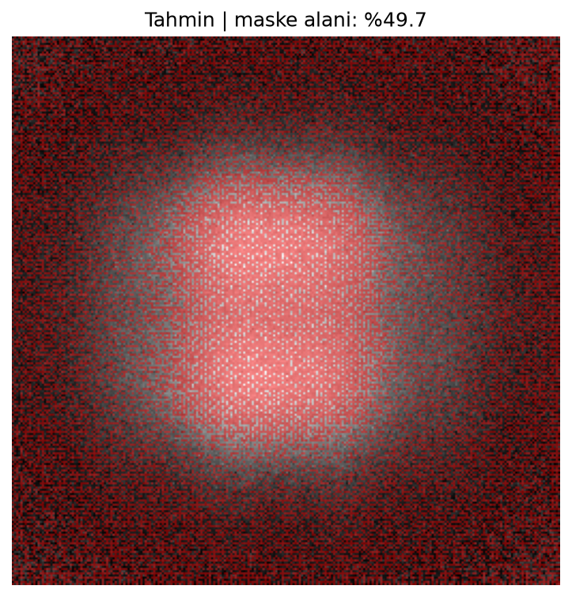

<div align="center">
  
  
  <br />
  <br />

  # 🫁 ChestX-Ray Vision: Deep Learning Medical Imaging Pipeline
  
  **State-of-the-Art, Memory-Efficient, & Reproducible Deep Learning Pipeline for Large-Scale (≥40 GB) Medical Image Analysis.**
  
  <p align="center">
    
    
    
    
    <br/>
    
    
    
  </p>

</div>

<br/>

> **"Bridging the gap between Medical Data and Clinical AI solutions."** 
> This pipeline is meticulously designed for researchers and engineers tackling large-scale medical imaging datasets. It provides a robust, production-ready environment optimized for low-memory footprint while deploying state-of-the-art architectures.

---

## ✨ Key Features

- 🧠 **SOTA Architectures:** Built-in support for cutting-edge models including `Swin-UNet`, `ViT (Vision Transformers)`, `DenseNet`, `Attention U-Net`, and `EfficientNet`.
- ⚡ **Zero OOM (Out Of Memory) Architecture:** Advanced memory handling leveraging *Lazy Loading*, *Automatic Mixed Precision (AMP)*, *Pinned Memory*, and *Sliding Window Inference*—process 40GB+ datasets seamlessly on limited hardware.
- 🔬 **Clinical Explainability (XAI):** Built-in **Grad-CAM** support generates heatmaps to visualize model attention, crucial for radiologist validation.
- 🛡️ **Zero Data Leakage:** Implements robust **Patient-based Stratified K-Fold CV** to ensure images from the same patient strictly stay within training, validation, or test sets.
- 📊 **Comprehensive EDA:** Automatically generates exploratory data analysis (EDA) reports including label distributions, mask area ratios, and intensity statistics before training begins.

---

## 📂 Project Structure

```text
chest_pipeline/
├── ⚙️ config.py        — Centralized hyperparameters and path management; experiment profiles
├── 📈 eda.py           — Exploratory Data Analysis: statistics, QA, and visualizations
├── 🗃️ datasets.py      — Lazy loading, DICOM/NIfTI/PNG support, DataLoader configurations
├── 🧠 models.py        — U-Net, U-Net++, Attention U-Net, Swin-UNet, DenseNet, ViT...
├── 📉 losses.py        — Dice-CE, Focal, Tversky, Lovász, Boundary, Combo, Asymmetric
├── 🏃‍♂️ trainer.py       — K-Fold CV, SAM optimizer, MixUp, Early Stopping, Cosine Annealing
├── ⚖️ evaluation.py    — Clinical metrics, Grad-CAM generation, ONNX/TorchScript exporting
├── 🚀 main.py          — End-to-end execution entry point
├── 📦 requirements.txt — Python dependencies
└── 🗂️ prepare_nih_chestxray14.py — Auto-preprocessing script for NIH Dataset
```

---

## 🛠️ Installation & Quick Start (Kaggle Ready)

This framework is highly optimized for Kaggle kernels and local GPU environments.

### 1. Install Dependencies
```bash
pip install monai[all] segmentation-models-pytorch lion-pytorch --quiet
```

### 2. Basic Setup & Execution
```python
import sys
from pathlib import Path
sys.path.insert(0, "/kaggle/working/chest_pipeline") # Or your local path

from config import Config
from main import main

# Initialize and configure
cfg = Config()
cfg.DATA_ROOT  = Path("/kaggle/input/<YOUR-DATASET-NAME>")
cfg.IMAGE_DIR  = cfg.DATA_ROOT / "images"
cfg.CSV_PATH   = cfg.DATA_ROOT / "labels.csv"

# Launch training pipeline
model, metrics, cfg = main(cfg)
```

---

## 🔌 How to Connect Your Own Dataset

You don't have to use built-in datasets! You can easily plug your own private/clinical dataset into the pipeline by simply preparing a standard `labels.csv` file mapping the image path to the mask/label.

```python
cfg = Config()
cfg.DATA_ROOT = Path("/path/to/your/private/dataset")
cfg.IMAGE_DIR = cfg.DATA_ROOT / "scans"
cfg.MASK_DIR  = cfg.DATA_ROOT / "segmentation_masks"
cfg.CSV_PATH  = cfg.DATA_ROOT / "patient_labels.csv" # Columns needed: image_path, label (or mask_path)
```

---

## 🧪 Built-in Smoke Testing (Synthetic Data)

If you just want to test if the pipeline runs on your hardware without downloading a massive 40GB dataset, the framework includes a **Synthetic Data Generator**. 
By running `python prepare_local_testdata.py`, the system mathematically generates 40 synthetic "X-Ray-like" images (using ellipses for lungs and sine waves for ribs). This allows you to verify end-to-end execution, memory limits, and codebase integrity instantly!

---

## 🫁 NIH ChestX-ray14: Ready-to-Use Setup

The pipeline features a dedicated script (`prepare_nih_chestxray14.py`) that instantly parses the famous **"nih-chest-xrays/data"** dataset (112,120 images, 14 multi-label findings). It properly splits the data based on `Patient ID` to completely eliminate data leakage.

<details>
<summary><b>👉 Click here to see the NIH Dataset setup code</b></summary>

```python
from prepare_nih_chestxray14 import prepare, NIH_CLASS_NAMES
from config import Config
from main import main

# Prepares the metadata.csv and parses all 12 subdirectories
meta_csv = prepare(output_dir="./working") 

# Configure for Classification
cfg = Config()
cfg.TASK        = "classification"
cfg.MULTI_LABEL = True
cfg.NUM_CLASSES = 14
cfg.CLASS_NAMES = NIH_CLASS_NAMES
cfg.CSV_PATH    = meta_csv
cfg.IN_CHANNELS = 1
cfg.MODEL_NAME  = "densenet121"    # CheXNet architecture baseline
cfg.LOSS_NAME   = "bce"
cfg.EPOCHS      = 30

model, metrics, cfg = main(cfg)
```
</details>

---

## 🧪 Technical Arsenal

### 🏛️ Architectures
| Model | Task | Lit. Reference |
|-------|------|----------------|
| **Swin-UNet** | Segmentation | *Cao et al., ECCV 2022* |
| **Attention U-Net** | Segmentation | *Oktay et al., MIDL 2018* |
| **ViT-B/16** | Classification | *Dosovitskiy et al., ICLR 2021* |
| **DenseNet-121 (CheXNet)** | Classification | *Rajpurkar et al., 2017* |

### 📉 Loss Functions
- **Segmentation:** `Dice-CE`, `Tversky` (for high FN cost), `Lovász-Softmax` (direct IoU optimization), `Boundary` (edge sensitivity).
- **Classification:** `Focal Loss`, `Asymmetric` (for severe class imbalance), `BCE`.

### 🚀 Training Optimizations
- **SAM (Sharpness-Aware Minimization):** Steers optimization towards flat minima for superior generalization.
- **MixUp:** Regularizes via linear interpolation of inputs and labels.
- **TTA (Test Time Augmentation):** Averages predictions over 8 geometric transforms for robust inference.
- **Cosine Annealing with Warmup:** Ensures stable early training and escapes local minima.

---

## 🖼️ Sample Outputs & Predictions

The pipeline yields visual outputs highlighting mask area predictions and diagnostic confidence. 

<div align="center">
  
  <br>
  <em>Sample output showcasing model prediction vs ground truth and mask coverage.</em>
</div>

---

## 📊 Evaluation Metrics

Depending on the configured task, the pipeline automatically generates comprehensive clinical reports:

*   **Classification:** AUC-ROC, PR-AUC, F1-Score (Macro/Weighted), Matthews Correlation Coefficient (MCC), Calibration Curves, Grad-CAM.
*   **Segmentation:** Dice Similarity Coefficient (DSC), Intersection over Union (IoU), Hausdorff Distance (HD95), Volume Similarity.

> 💡 **Tip:** After the first run, check `outputs/eda/quality_report.csv` to identify broken/corrupted images in your dataset before training!

---

<div align="center">
  <sub>Developed for the Advancement of Medical AI. For inquiries or contributions, please open an issue or pull request.</sub>
</div>
